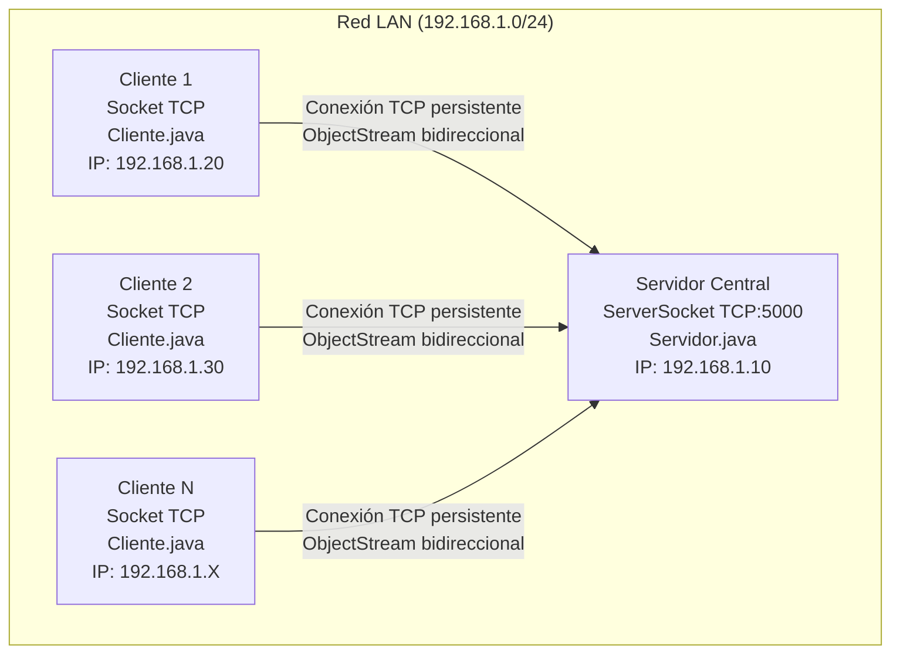
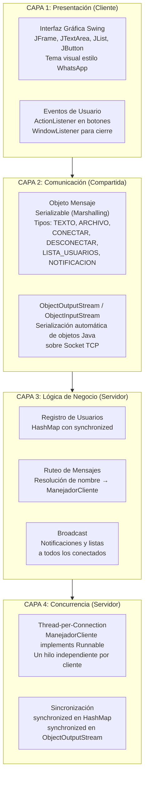
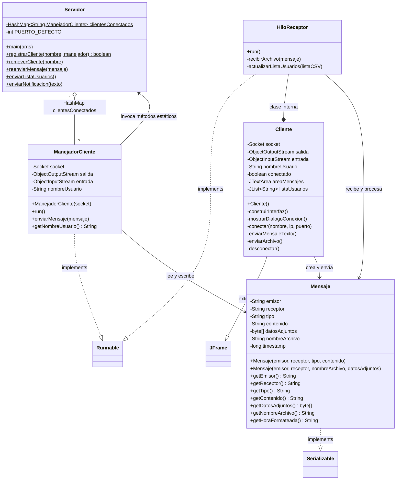
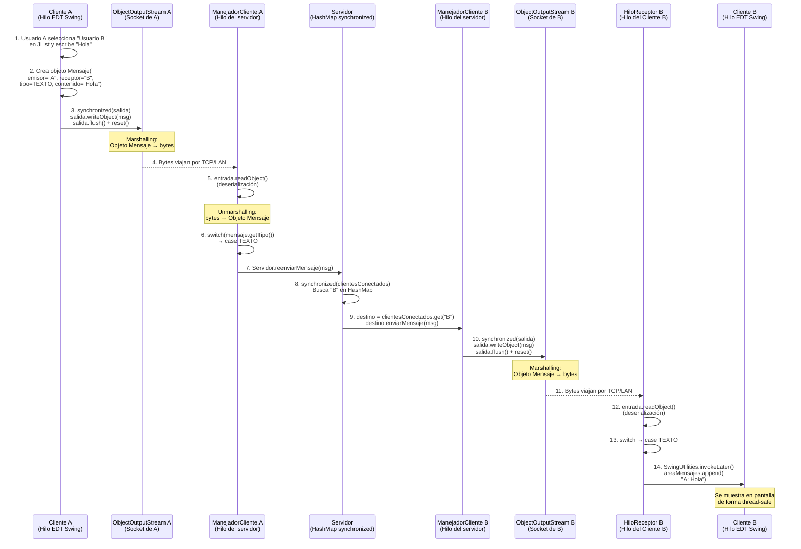
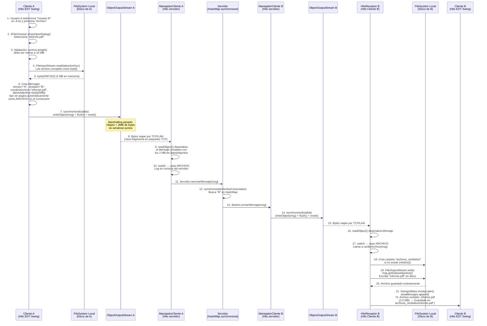

# Informe Completo de Modelado — WhatsApp Distribuido

Documento técnico para la construcción de los tres modelos requeridos: **Modelo Físico**, **Modelo Arquitectónico** y **Modelado de Funciones (Diagramas de Secuencia UML)**.

---

## 1. MODELO FÍSICO

### 1.1 Identificación de Nodos

El sistema se compone de dos tipos de nodos que se ejecutan como procesos Java independientes:

| Nodo | Archivo de Entrada | Descripción | Cantidad | Puerto |
|---|---|---|---|---|
| **Servidor Central** | `server.Servidor.main()` | Proceso que escucha conexiones TCP entrantes en un `ServerSocket`. Mantiene en memoria un `HashMap` con todos los clientes registrados. Actúa como enrutador central de mensajes. | **1 (único)** | TCP `5000` (configurable) |
| **Cliente N** | `client.Cliente.main()` | Proceso con interfaz gráfica Swing (`JFrame`). Se conecta al servidor mediante un `Socket(ip, puerto)`. No conoce la IP de otros clientes. | **N (ilimitados)** | Puerto efímero asignado por el SO |

**Nodos internos del Servidor (hilos, no procesos separados):**

| Componente Interno | Clase | Relación |
|---|---|---|
| Hilo Principal del Servidor | `Servidor.main()` | Bucle infinito en `serverSocket.accept()`, acepta conexiones |
| Hilo Manejador (1 por cliente) | `ManejadorCliente` (implementa `Runnable`) | Creado con `new Thread(manejador).start()` por cada conexión aceptada |

**Nodos internos del Cliente (hilos):**

| Componente Interno | Clase | Relación |
|---|---|---|
| Hilo Principal (EDT de Swing) | `Cliente` (extiende `JFrame`) | Maneja la interfaz gráfica y los eventos del usuario (botones, texto) |
| Hilo Receptor | `HiloReceptor` (clase interna, implementa `Runnable`) | Bucle infinito leyendo objetos `Mensaje` desde el socket con `entrada.readObject()` |

### 1.2 Entorno de Red

| Característica | Valor en el Proyecto |
|---|---|
| **Tipo de Red** | **LAN** (Red de Área Local). Los clientes se conectan al servidor usando su IPv4 privada (ej: `192.168.1.X`). También funciona en `localhost` (misma máquina). |
| **Protocolo de Transporte** | **TCP** (Transmission Control Protocol). Garantiza entrega ordenada y sin pérdida de paquetes. Implementado con `java.net.Socket` y `java.net.ServerSocket`. |
| **Protocolo de Aplicación** | **Serialización de objetos Java** (Marshalling). Se envían objetos `Mensaje` completos usando `ObjectOutputStream.writeObject()` y se reciben con `ObjectInputStream.readObject()`. |
| **Puerto del Servidor** | `5000` por defecto. Configurable como argumento de línea de comandos. |
| **Dirección de Binding** | `0.0.0.0` (implícito al usar `new ServerSocket(puerto)` sin especificar dirección). Acepta conexiones desde cualquier interfaz de red. |
| **Límite de transferencia** | Archivos de hasta **10 MB** (validado en `Cliente.enviarArchivo()`, línea 350). |

### 1.3 Representación Gráfica de la Interconexión (Topología de Estrella)



> [!IMPORTANT]
> **No existe comunicación directa entre clientes.** Todo el tráfico pasa obligatoriamente por el servidor central (topología de estrella). Si el Cliente 1 quiere enviar un mensaje al Cliente 2, el mensaje viaja: `Cliente 1 → Servidor → Cliente 2`.

### 1.4 Estructura de Archivos del Proyecto (Despliegue Físico)

```
Proyecto paralela/
├── compile.bat              ← Compila todo con javac hacia /bin
├── run_server.bat           ← Ejecuta: java -cp bin server.Servidor 5000
├── run_client.bat           ← Ejecuta: java -cp bin client.Cliente
├── src/
│   ├── common/
│   │   └── Mensaje.java     ← Objeto serializable (protocolo)
│   ├── server/
│   │   ├── Servidor.java    ← Punto de entrada del servidor
│   │   └── ManejadorCliente.java ← Runnable: un hilo por cliente
│   └── client/
│       └── Cliente.java     ← GUI Swing + HiloReceptor interno
├── bin/                     ← Archivos .class compilados
└── archivos_recibidos/      ← Carpeta donde se guardan archivos recibidos
```

---

## 2. MODELO ARQUITECTÓNICO

### 2.1 Tipo de Arquitectura

**Cliente-Servidor Centralizado** con las siguientes características:

| Propiedad | Implementación |
|---|---|
| **Patrón** | Cliente-Servidor de 2 capas (2-Tier) |
| **Comunicación** | Sockets TCP con serialización de objetos Java |
| **Concurrencia** | Thread-per-Connection (un hilo por cada cliente conectado) |
| **Sincronización** | Bloques `synchronized` sobre el `HashMap` compartido y los `ObjectOutputStream` |
| **Transparencia de Ubicación** | El cliente usa nombres de usuario, no direcciones IP, para identificar destinatarios |
| **Transparencia de Acceso** | La interfaz de envío es idéntica sin importar la ubicación física del destinatario |

### 2.2 Definición de Capas



### 2.3 Componentes Principales y sus Relaciones



### 2.4 Flujo General de Comunicación


### 2.5 Tipos de Mensaje (Protocolo de Aplicación)

| Tipo (constante) | Dirección | Propósito | Campos Utilizados |
|---|---|---|---|
| `CONECTAR` | Cliente → Servidor | Solicitud de login. Primer mensaje obligatorio tras abrir socket. | `emisor` = nombre del usuario |
| `DESCONECTAR` | Cliente → Servidor | Notificación de cierre voluntario. Dispara `removerCliente()`. | `emisor` = nombre del usuario |
| `TEXTO` | Cliente → Servidor → Cliente | **Función 1:** Envío de mensaje de texto privado. | `emisor`, `receptor`, `contenido` |
| `ARCHIVO` | Cliente → Servidor → Cliente | **Función 2:** Envío de archivo multimedia (hasta 10 MB). | `emisor`, `receptor`, `nombreArchivo`, `datosAdjuntos` (byte[]) |
| `LISTA_USUARIOS` | Servidor → Todos los Clientes | Broadcast con los nombres de todos los usuarios conectados separados por coma. | `contenido` = "usuario1,usuario2,usuario3" |
| `NOTIFICACION` | Servidor → Cliente(s) | Mensajes del sistema: bienvenida, errores, avisos de conexión/desconexión. | `contenido` = texto de la notificación |

---

## 3. MODELADO DE FUNCIONES (Diagramas de Secuencia UML)

### 3.1 FUNCIÓN 1: Envío y Recepción de Mensaje de Texto

**Escenario:** El Usuario A escribe "Hola" y lo envía al Usuario B. Ambos ya están conectados al servidor.

**Código involucrado:**
- Emisión: `Cliente.enviarMensajeTexto()` (líneas 294-324)
- Recepción en servidor: `ManejadorCliente.run()` → `case Mensaje.TEXTO` (línea 129)
- Ruteo: `Servidor.reenviarMensaje()` (líneas 206-232)
- Envío al destino: `ManejadorCliente.enviarMensaje()` (líneas 224-245)
- Recepción en cliente: `HiloReceptor.run()` → `case Mensaje.TEXTO` (línea 446)



**Detalles técnicos críticos del flujo:**
- **Paso 3 — `synchronized(salida)` en el Cliente:** Protege el `ObjectOutputStream` porque el hilo EDT (que maneja los clics) podría intentar enviar un mensaje mientras otro evento de envío aún no termina.
- **Paso 3 — `salida.reset()`:** Sin este llamado, `ObjectOutputStream` mantiene un caché interno de referencias. Si se envía un segundo mensaje, Java detectaría que "ya envió un objeto Mensaje antes" y enviaría solo una referencia al anterior, haciendo que el receptor lea datos obsoletos.
- **Paso 8 — `synchronized(clientesConectados)`:** Garantiza exclusión mutua. Si Cliente C se está conectando al mismo tiempo que A envía un mensaje, ambas operaciones no pueden modificar/leer el HashMap simultáneamente.
- **Paso 14 — `SwingUtilities.invokeLater()`:** El `HiloReceptor` NO puede modificar componentes Swing directamente (no es thread-safe). Este método encola la actualización visual para que la ejecute el hilo EDT de Swing.

### 3.2 FUNCIÓN 2: Envío y Recepción de Archivo Multimedia

**Escenario:** El Usuario A selecciona un archivo PDF de 2 MB desde su disco y lo envía al Usuario B.

**Código involucrado:**
- Emisión: `Cliente.enviarArchivo()` (líneas 333-381)
- Recepción en servidor: `ManejadorCliente.run()` → `case Mensaje.ARCHIVO` (líneas 132-143)
- Ruteo: `Servidor.reenviarMensaje()` (líneas 206-232) — mismo método que texto
- Recepción en cliente: `HiloReceptor.run()` → `case Mensaje.ARCHIVO` → `recibirArchivo()` (líneas 486-503)



**Detalles técnicos críticos del flujo:**
- **Paso 4 — Lectura completa en memoria:** El archivo se carga entero en un `byte[]`. Esto permite que Java serialice los datos binarios junto con el resto del objeto `Mensaje` de forma atómica (todo o nada).
- **Paso 6 — Constructor especial de Mensaje:** Cuando se usa el constructor `Mensaje(emisor, receptor, nombreArchivo, datosAdjuntos)`, el `tipo` se asigna automáticamente como `ARCHIVO` internamente (línea 91 de Mensaje.java).
- **Paso 8 — Fragmentación TCP:** Aunque el objeto serializado puede pesar megabytes, TCP se encarga automáticamente de fragmentarlo en paquetes de red de tamaño apropiado y reensamblarlos en orden al otro lado. Esto es transparente para el programador.
- **Paso 18 — Creación de directorio:** El cliente receptor crea automáticamente la carpeta `archivos_recibidos/` en el directorio de trabajo si no existe, usando `File.mkdirs()`.

---

## RESUMEN DE CONCEPTOS DE SISTEMAS DISTRIBUIDOS IMPLEMENTADOS

| Concepto | Dónde se Implementa | Cómo |
|---|---|---|
| **Comunicación TCP** | `ServerSocket`, `Socket` | Conexiones persistentes bidireccionales entre cliente y servidor |
| **Marshalling / Serialización** | `ObjectOutputStream.writeObject()`, `ObjectInputStream.readObject()` | Objetos `Mensaje` (que implementan `Serializable`) se convierten automáticamente a bytes para viajar por la red |
| **Transparencia de Ubicación** | `Servidor.reenviarMensaje()` | El emisor indica solo el nombre del destinatario. El servidor resuelve la ubicación buscando en su `HashMap` |
| **Transparencia de Acceso** | `Cliente.enviarMensajeTexto()`, `Cliente.enviarArchivo()` | La interfaz de envío es idéntica sin importar dónde esté el destinatario (localhost, LAN, WAN) |
| **Concurrencia** | `ManejadorCliente implements Runnable`, `HiloReceptor implements Runnable` | Un hilo por conexión en el servidor; un hilo receptor separado en el cliente |
| **Sincronización** | `synchronized(clientesConectados)`, `synchronized(salida)` | Exclusión mutua sobre el HashMap compartido y sobre los streams de escritura |
| **Resiliencia** | Bloques `try-catch-finally` en `ManejadorCliente.run()` | Si un cliente falla, solo su hilo muere. El servidor limpia recursos y notifica a los demás |
| **Prevención de Deadlock** | Orden de inicialización: `ObjectOutputStream` antes de `ObjectInputStream` | Ambos lados envían la cabecera de serialización antes de intentar leerla |
